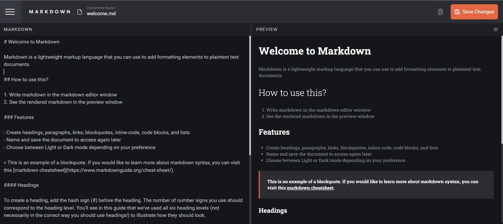
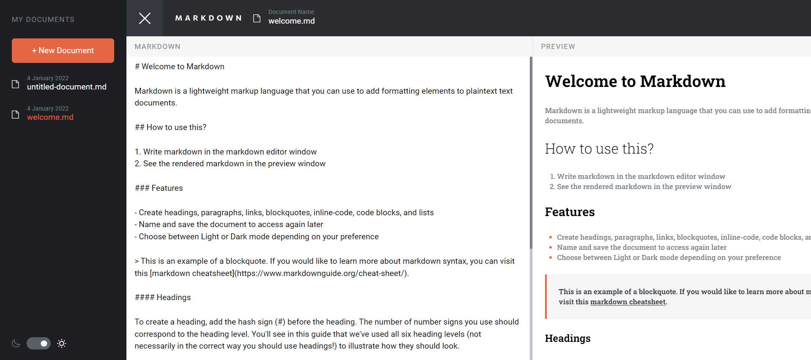

# Table of contents

- [Overview](#overview)
  - [The challenge](#the-challenge)
  - [Built with](#built-with)
  - [Links](#links)
  - [Screenshot](#screenshot)

## Overview

### The challenge

Users should be able to:

- Create, Read, Update, and Delete markdown documents ✅
- Name and save documents to be accessed as needed ✅
- Edit the markdown of a document and see the formatted preview of the content ✅
- View a full-page preview of the formatted content ✅
- View the optimal layout for the app depending on their device's screen size ✅
- See hover states for all interactive elements on the page ✅
- **Bonus**: If you're building a purely front-end project, use localStorage to save the current state in the browser that persists when the browser is refreshed ✅

### Built with

- [React](https://reactjs.org/)
- [TypeScript](https://www.typescriptlang.org/)
- [Vite](https://vitejs.dev/)
- [TailwindCSS](https://tailwindcss.com/)
- [Zustand](https://github.com/pmndrs/zustand)
- [React-toastify](https://fkhadra.github.io/react-toastify/)
- [React-markdown](https://github.com/remarkjs/react-markdown)

### Links

- Live Site URL: [https://in-browser-markdown-editor-gray.vercel.app/](https://in-browser-markdown-editor-gray.vercel.app/)
- Solution URL: [https://www.frontendmentor.io/solutions/inbrowser-markdown-editor-react-typescript-tailwindcss-iRIyCS0DEf](https://www.frontendmentor.io/solutions/inbrowser-markdown-editor-react-typescript-tailwindcss-iRIyCS0DEf)

### Screenshot

